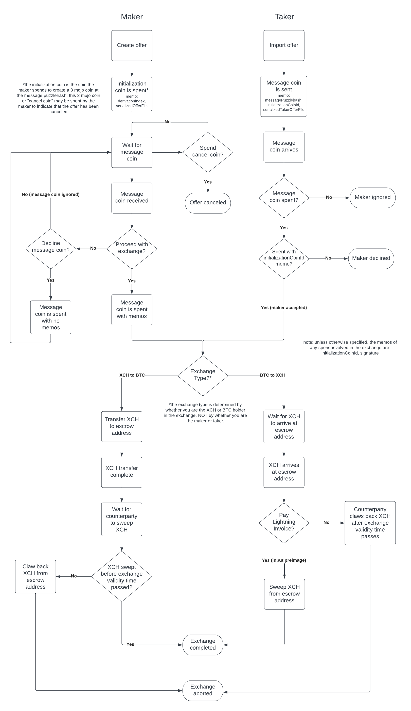

# Chiaswap Documentation

Chiaswap is a variation of submarine swap enabling trustless exchange of coins between BTC and XCH. 

To better understand submarine swaps the following are helpful documentation:
* [Atomic Settlement (a perfect match)](https://github.com/decred/dcrdex/blob/master/spec/atomic.mediawiki#case-a-perfect-match)
* [Understanding Submarine Swaps](https://docs.lightning.engineering/the-lightning-network/multihop-payments/understanding-submarine-swaps)
* [How do submarine swaps work?](https://medium.com/suredbits/how-do-submarine-swaps-work-907ed0d91498)

The original protocol and implementation for Chiaswap can be found [here](https://github.com/richardkiss/chiaswap). The Chia Crypto Utils implementation allows Chiaswap exchanges to take place asynchronously using a mechanism similar to a Chia offer file. 

## Prerequisites
You will need the Evergreen Mobile app and a Lightning wallet app that supports preimage reveal in order to participate in an exchange. Evergreen Mobile will be used to make and take offers and transfer XCH, and the Lightning wallet app will be used to create and pay the BTC lightning payment request. 

### [Evergreen Mobile](https://evergreenminer.com/)
iOS - https://apps.apple.com/us/app/evergreen-mobile/id1623296568

Android - https://play.google.com/store/apps/details?id=com.evergreenminer.evergreen

### Compatible Lightning Wallets
### [Muun](https://muun.com/)

iOS - https://apps.apple.com/us/app/muun-wallet/id1482037683

Android - https://play.google.com/store/apps/details?id=io.muun.apollo

### [BlueWallet](https://bluewallet.io/)
iOS - https://apps.apple.com/us/app/bluewallet-bitcoin-wallet/id1376878040 

Android - https://play.google.com/store/apps/details?id=io.bluewallet.bluewallet 

### [Zeus](https://zeusln.app/)
iOS - https://apps.apple.com/us/app/zeus-ln/id1456038895 

Android - https://play.google.com/store/apps/details?id=app.zeusln.zeus 

## Making an Offer
The maker of an offer needs a keychain and enough XCH to cover the cost of initalizing the offer (3 mojos + mojos for the fee). The maker will input the following values to create the Cross Chain Offer File: 

* The amount offered (XCH or BTC)
* The amount requested (BTC or XCH)
* The offer validity time (the time when the offer expires and can no longer be accepted)
* A lightning payment request for the amount of BTC being exchanged

The keychain is used to generate a private key and message puzzlehash for this offer, which together with the inputted values are used to create and serialize a ccoffer file. To initialize an offer, one of the maker's coins is spent to create a 3 mojo child at the message puzzlehash. 

The memos of this spend include the derivation index of the private key used for the exchange such that it may later be easily reconstructed, as well as the serialized offer file. The coin that is spent is the initialization coin, and the 3 mojo child coin that is created may be later spent to indicate that the offer is canceled. The initialization coin ID is included in the offer file and as a memo on all subsequent exchange transactions, which allows for the exchange to be restored from either of the participant's keychains. 

The maker can post their serialized offer file to [dexie](https://dexie.space/ccoffers/) so that it may be publicly viewed. Currently only XCH -> BTC offer files are supported by Dexie. If the maker spends the 3 mojo coin at the message puzzlehash to indicate cancelation, Dexie will take this the offer down. 

## Taking an Offer
The taker of an offer needs a keychain and enough XCH to cover sending a message coin (100000000 + mojos for the fee). They input the serialized offer file, the exchange validity time, which is the amount of time alotted for the exchange to complete after the XCH holder transfers funds, and, if they are the XCH holder, a lightning payment request for the amount of BTC being exchanged. The taker's keychain and inputted values are used to create and serialize a ccoffer_accept file, which is sent as a memo to the message puzzlehash specified in the maker's offer file using a [notification coin](https://github.com/Chia-Network/chia-blockchain/blob/main/chia/wallet/notification_manager.py). 

## Completing the Exchange
When the maker receives a message coin, they will choose to do one of the following:
1. Decline the message by spending it with no memos and keep waiting for a different message coin.
2. Accept the message coin by spending it with the specified memos (initialization coin ID and signature).

After the message coin is accepted, the escrow address is generated on both the maker's and taker's side using their respective private keys and values from the ccoffer and ccoffer_acccept files. The escrow address is where XCH is temporarily held until the lightning payment request is paid. At this point, the XCH holder transfers the amount of XCH being exchanged to the escrow address, locking the funds with a [unique puzzle](https://github.com/richardkiss/chiaswap#custom-chialisp). XCH at the escrow address may be spent under two conditions:

1. The BTC holder may sweep XCH from the escrow puzzlehash if they provide the preimage receipt, which is revealed only after a lightning payment request is paid, transferring BTC to the XCH holder. This is how the exchange is completed.
2. If the exchange validity time has passed and the XCH at the escrow puzzlehash has not yet been spent by the BTC holder, the XCH holder may claw the funds back using their private key. This is how the exchange is aborted in the event that the BTC holder decides not to hold up their end of the exchange after the escrow transfer. 

This works in a similar fashion as [Hash Time-Locked Contracts](https://github.com/lnbook/lnbook/blob/develop/08_routing_htlcs.asciidoc#hash-time-locked-contracts) on the Bitcoin blockchain. 

## Chiaswap Flowchart 
